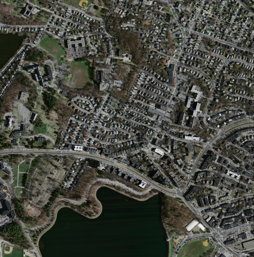
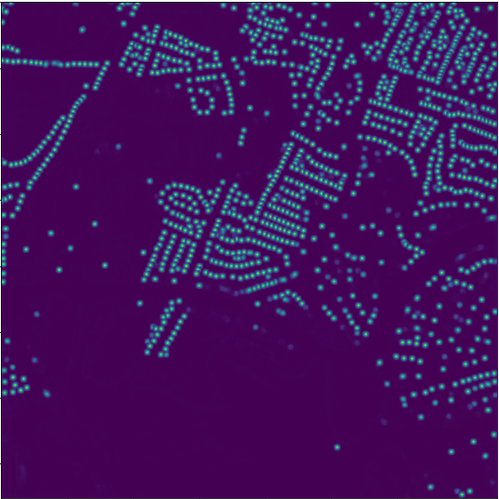

# Centroid Unet - Locating Object Centroids in Satellite Images

### Introduction

Centroid-UNet is deep neural network model to detect centroids from satellite images. We have tested this model with two case studies (building centroid detection and agriculture plot centroid detection). This network is based on classic U-Net sematic segmentation architecture. Satellite RGB images are used as input data for the model. And images generated with Gaussians surrounding centroids of instances are used as target for the model. Sample input and prediction from the model is shown in below figure.

<b>Sample Input</b>

<b>Sample Prediction</b>

### How to Use

Input data are RGB satellite images. Target data can be given as JSON files with list of centroids points in each satellite image tiles. First Gaussians are generated around lists of centroids points, then images are generated as targets for the model during preprocessing steps (*/code/DataUtils.py*). If we use centroids as it is without Gaussians, training process will be challenging. Using Gaussians instead of just centroids make training process more stable. Radius of the Gaussian (in pixels) can be modified depending on the application to minimize overlapping. As example, in case of agriculture plot centroid case study, large radius can be used because typically agriculture plots are larger. On the other hand, small radius is recommended for building centroid case study. Sample data is also given with this repository (*/code/data/MassachBuilding/*). 

Our model is U-Net architecture which was written in Keras with Tensorflow backend (*/code/Model.py*). You can modify the model according to your requirement as well.

### Libraries used
- numpy
- matplotlib
- imageio
- keras (tensorflow)

### References

- Ronneberger, O. et al. “U-Net: Convolutional Networks for Biomedical Image Segmentation.” MICCAI (2015).
- Massachusetts Buildings Dataset - https://www.cs.toronto.edu/~vmnih/data/
- Nice agriculture plot datasets
  	- Netherlands LPIS agricultural field boundaries - https://www.pdok.nl/introductie/-/article/basisregistratie-gewaspercelen-brp-
	- Denmark LPIS agricultural field boundaries - https://kortdata.fvm.dk/download/Markblokke_Marker?page=MarkerHistoriske
	- Luxembourg LPIS agricultural field boundaries - https://data.public.lu/en/datasets/inspire-annex-ii-theme-land-cover-landcoverunit-land-parcel-identification-system-lpis-2017-reference-data-of-agricultural-parcels/

