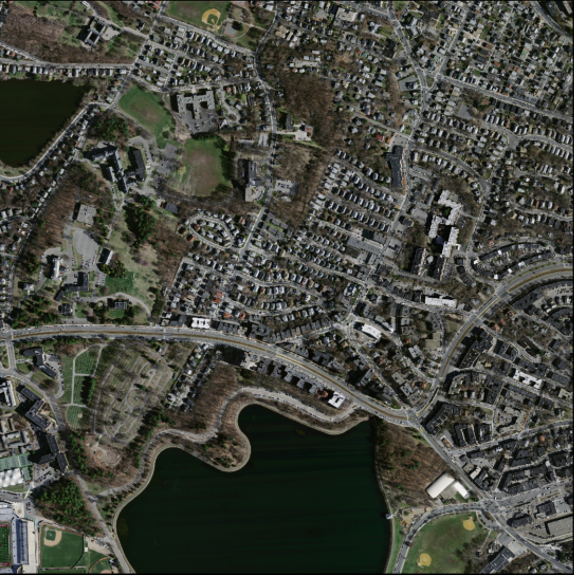
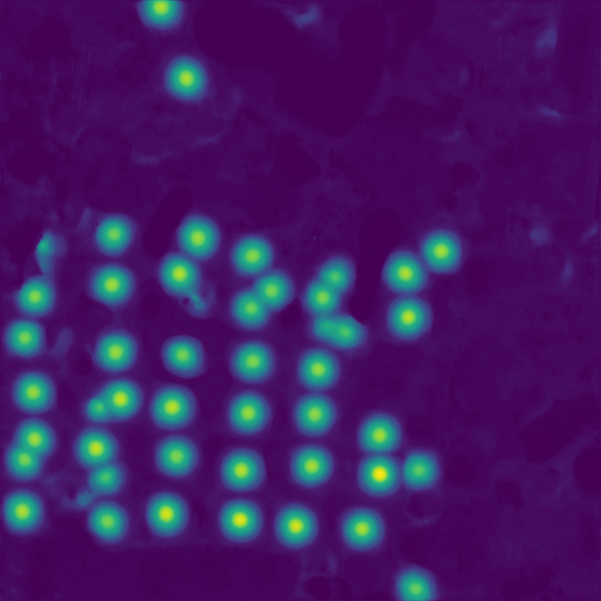

# Centroid UNet - Locating Object Centroids in Aerial/Serial Images

__Paper (Proccedings of the 42nd Asian Conference on Remote Sensing, 2021, Can Tho city, Vietnam) - https://arxiv.org/abs/2112.06530__

### Introduction

Centroid-UNet is deep neural network model to detect centroids from Aerial/Satellite images. We have tested this model with two case studies (building centroid detection and coconut tree centroid detection). This network is based on classic U-Net sematic segmentation architecture. In case of aerial/satellite image analysis (remote sensing), generation of exact shapes of objects is cumbersome task. And, most of application such as counting requires estimation of only locations of objects. Hence, locating objects centroids from aerial/satellite image is an easy solution for tasks where object exact shape is not necessary. Sample input and prediction from the model is shown in below figure.

<table style="width:100%">
	<tr>
		<th>Sample Input</th>
		<th>Sample Prediction</th>
	</tr>
	<tr>
		<td>
		

		
		

		</td>
    		<td>
		

		
		

		</td>
	</tr>
	<tr>
		<td>
		

		
		

		</td>
    		<td>
		

		
		

		</td>
	</tr>
</table>

### How to Use

Input data are RGB satellite images. Target data can be given as JSON files with list of centroids points in each aerial/satellite image tiles. First Gaussians are generated around lists of centroids points, then images are generated as targets for the model during preprocessing steps (*/code/DataUtils.py*). If we use centroids as it is without Gaussians, training process will be challenging. Using Gaussians instead of just centroids make training process more stable. Radius of the Gaussian (in pixels) can be modified depending on the application to minimize overlapping. Few sample data is also given with this repository (*/code/data/MassachBuilding/* and */code/data/AgriPlot/*) to understand data format required to run. 

Our model is U-Net architecture which was written in Keras with Tensorflow backend (*/code/Model.py*). You can modify the model according to your requirement as well. Two Jupyter notebooks (*/code/Centroid-UNet_MassachBuilding.ipynb* and */code/Centroid-UNet_TongoCoconutTree.ipynb*) were used to run two case studies (building centroid detection and coconut tree centroid detection). If you are using this repository, you can start with one of these notebooks and adapt to your datasets.

### Libraries used
- numpy
- matplotlib
- imageio
- keras (tensorflow)

### References

- Ronneberger, O. et al. “U-Net: Convolutional Networks for Biomedical Image Segmentation.” MICCAI (2015).
- Duan, Kaiwen et al. “CenterNet: Keypoint Triplets for Object Detection.” 2019 IEEE/CVF International Conference on Computer Vision (ICCV) (2019): 6568-6577.
- Massachusetts Buildings Dataset - https://www.cs.toronto.edu/~vmnih/data/
- Coconut Trees Dataset - https://docs.google.com/document/d/16kKik2clGutKejU8uqZevNY6JALf4aVk2ELxLeR-msQ/edit

